## Instructions

1. Get Token from Discord for the discord bot.

   https://discord.com/developers/applications/

2. Click on the `New Application` to create new application.

   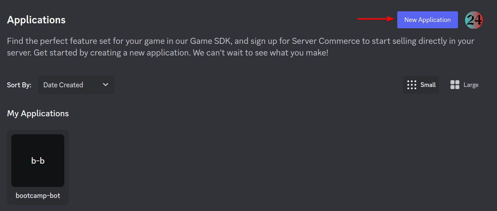

   Add the name of the discord bot and then click the `Create` button.

3. Go to the `bot` tab in the sidebar. Then click the `Add bot` button

   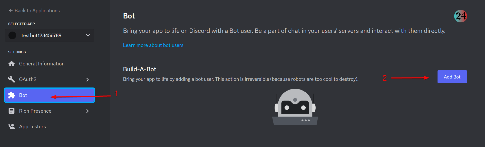

   Agree to the creation of the bot

4. Turn on the following permissions. To make the setup easy if ever the bot needs to be improved.

   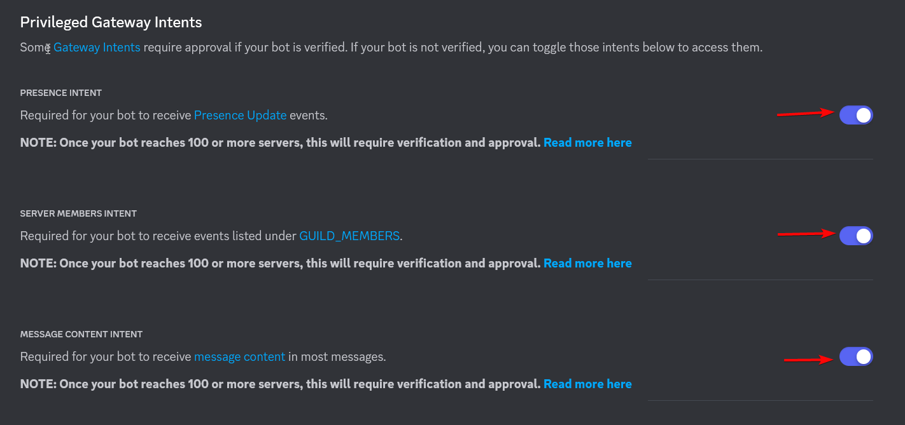

   Then click the `save changes`

5. Copy the token generated.

   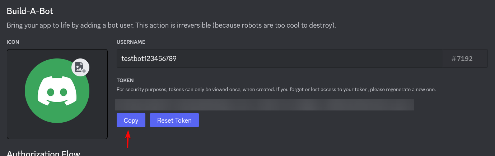

   If it doesn't appear Just click the `reset token`

   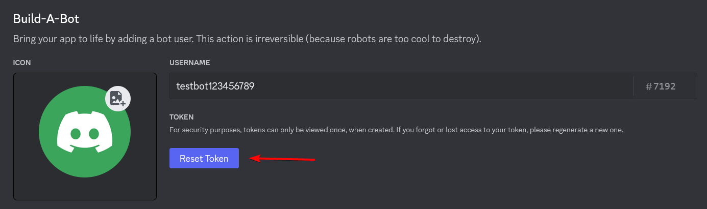

6. Make a copy of the [.env.example](.env.example) file and rename it into `.env`

7. Paste the generated token into the `.env` file.

   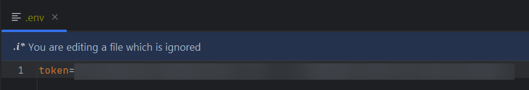

8. To generate the invite link of the discord bot. Go back to the discord tab.

   Go to the `OAuth2` and then click the `URL Generator`

   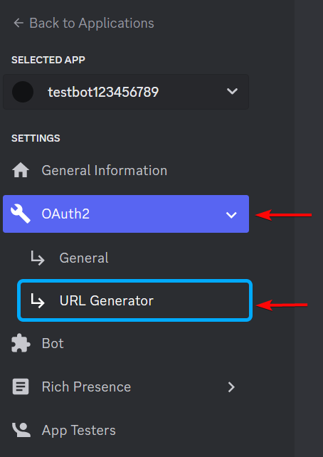

9. Check the `bot` for the scopes.

   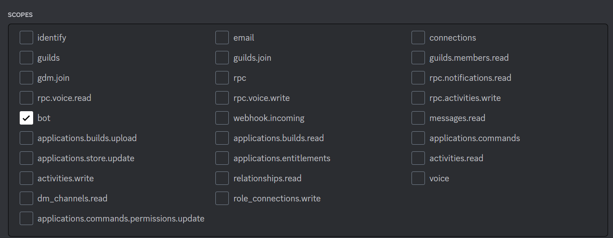

10. Click the `Administrator` for the bot permissions. Since we are going to use the bot only in this server, it will
    make the selection of the permissions for the bot easier.

    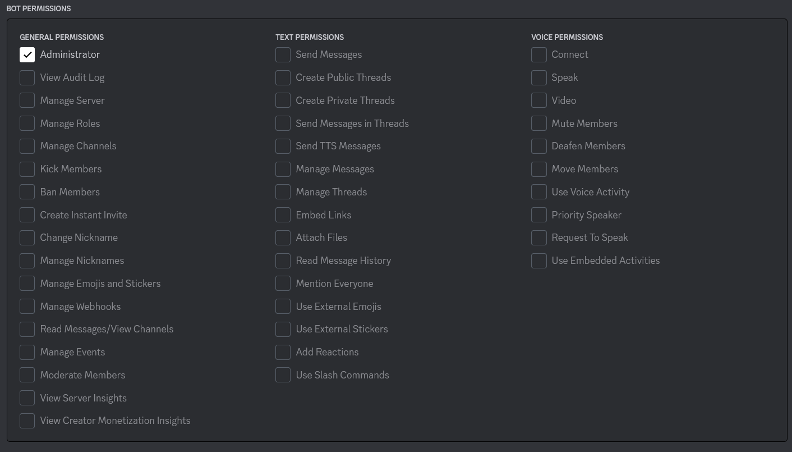

    Otherwise, select the following permissions for the current bot.

    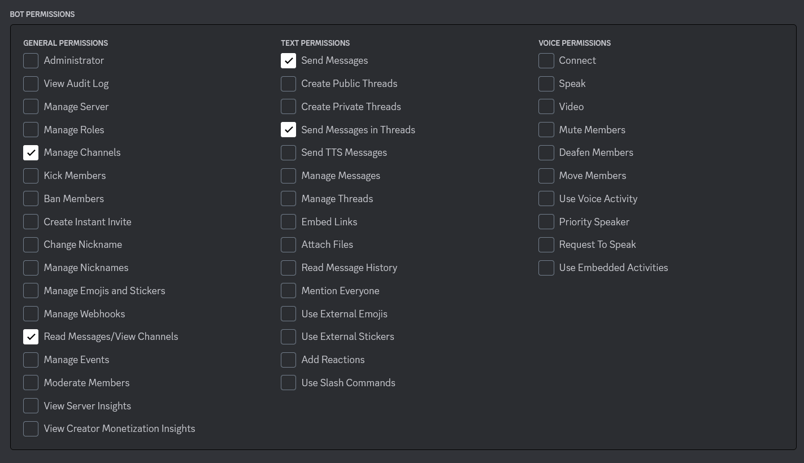

11. Scroll down and now we can copy the `discord invite link`

    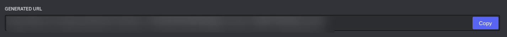

